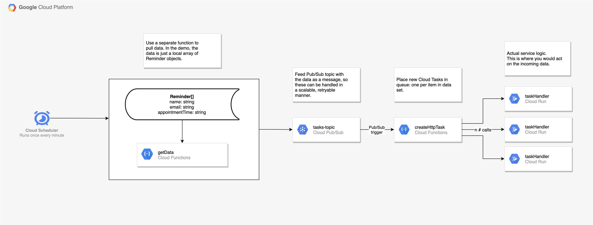

# GCP Demo: Distributing a scheduled job over Cloud Scheduler and Cloud Tasks tasks

This repo demonstrates how to:

- Set up a **scheduled activity (using Cloud Scheduler)** that pulls data (an array of objects) from local data in a **Cloud Function** that offloads the data to **Pub/Sub**...
- Which in turn has a Cloud Function trigger on a topic, that divides the retrieved data into **Cloud Tasks**, so that the individual pieces of data are handled uniquely, then...
- Run a service on **Cloud Run** to do something with the data from each individual task.
- Bonus: Creating and using separate service accounts for each service and using a completely private setup.

## Prerequisites

- You have a GCP account
- You are logged in through your environment
- You have set your variables as needed in `init.sh` and the respective `deploy.sh` files

## Instructions

### Run locally

- Install dependencies with `npm install` or `yarn install`.
- Run `npm start` or `yarn start`
- Call or visit endpoint; should be `http://localhost:8080/`

### Deploy to GCP

First of all, go through all scripts with names like `init.sh`, `deploy.sh` and `index.js` and ensure you set any relevant values that you are asked for.

Run `init.sh`. You should run this in steps since some things need to be done dynamically (like adding IDs).

Functions will have deployment URLs in the format `https://{REGION}-{PROJECT}.cloudfunctions.net/{FUNCTION}`. You'll also get a unique URL to the Cloud Run service.

### Where to find things

Logs are available in the [Logs view](https://console.cloud.google.com/logs/query) or through the [Functions view](https://console.cloud.google.com/functions/list).

The Cloud Run service is available at the [Services view](https://console.cloud.google.com/run).

Cloud Scheduler will display the job in the [Jobs view](https://console.cloud.google.com/cloudscheduler). For the Cloud Tasks queue, it's visible at [Queues](https://console.cloud.google.com/cloudtasks), which is good to have a look at if your calls are getting stuck (i.e. not working as intended).

### Remove resources

Run `teardown.sh`. This will destroy the entire project, so know what you are getting into!

## References

- [Creating Cloud Tasks queues](https://cloud.google.com/tasks/docs/creating-queues)
- [Creating HTTP Target tasks](https://cloud.google.com/tasks/docs/creating-http-target-tasks)
- [Cloud Scheduler quickstart](https://cloud.google.com/scheduler/docs/quickstart)
- [Cloud Tasks versus Cloud Scheduler](https://cloud.google.com/tasks/docs/comp-tasks-sched)
- [Functions Framework](https://cloud.google.com/functions/docs/functions-framework)
- [functions-framework](https://github.com/GoogleCloudPlatform/functions-framework)
